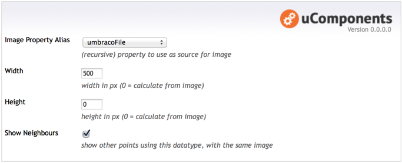

## Prevalue Editor Settings

**Image Property Alias** :  The property alias to to use for the image url source. This can be a property on the same node, or if on content or media it can be a property further up the tree hierarachy - the closest property is used. This property can be an image upload, or any datatype that stores a relative url to an image. (If this is empty, then both the _Height_ and _Width_ must be specified).

**Width** : When specified, this will override the image width.

**Height** : When specified, this will override the image height.

**Show Neighbours** : When checked, a gray spot for every neighbouring ImagePoint type using the same image, will be shown on the image.

If either a _Width_ or _Height_ is > 0 and the other is set to 0, then dimension set to 0 will be calculated from the image so as to maintain the correct aspect ratio.
  
## Content Editor

Image Point allows a marker to be placed on an image and positioned by dragging it or updating the X, Y textboxes. It can be removed by dragging it off the image or clearing the textboxes.

## Example XML

	<ImagePoint x="256" y="82" width="500" height="290" />

## Strongly Typed Model

Whether you use uQuery, DynamicNode or the IPublishedContent Model a strongly typed object can be returned with the following properties:

	bool	HasCoordinate
	int? 	X
	int? 	Y
	int 	Width
	int 	Height
	byte 	PercentageX
	byte 	PercentageY

_The hierarchical nature of aquiring the image allows other data to be associated with any given point, for example by using this datatype in child nodes / media of an ancestor with an image._

