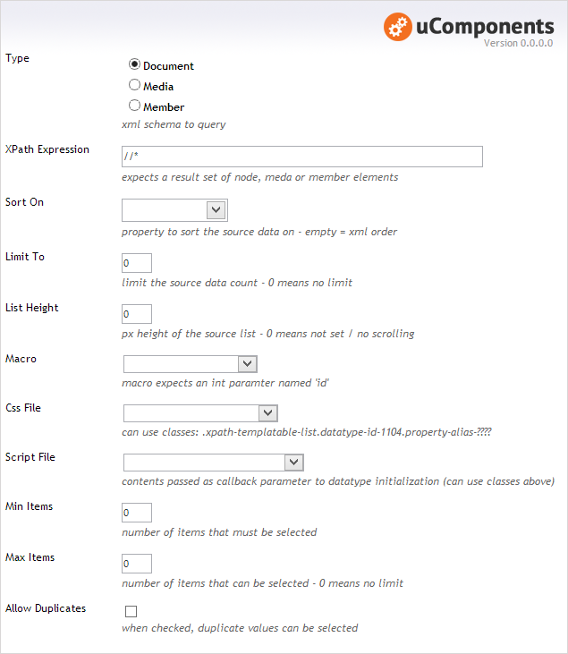

## Prevalue Editor Settings

In the example above, the datatype has been configured to use the three oldest members, requiring one or two of them to be selected.

**Type** : The XML schema to query.

**XPath Expression** : All matched nodes will be used for the source data in the list.

**Sort On** : Allows the source data to be sorted.

**Sort Direction** : (only present when _Sort On_ set)

**Limit To** : Limit the source data to a defined count.

**List Height** : Height in px, of the whole control - useful for when there is a sizeable amount of data in the source list; a scroll bar will be added if the height of all items exceeds this value.

**Macro** : (Optional) macro to use as the rendering mechanism for each item. The selected macro should have a parameter called 'id' of type number, and return the markup to be used for each item in the list - if the macro returns an empty string, then the item asscociated with that macro execution will be omited from the list - this allows additional configuration behaviour, eg. such as preventing items from being selectable if the current user doens't have permission etc...

**Css File** : (Optional) css file used to style the list.

**Script File** : (Optional) script to run after the data-type has finished it's initialization.

**Min Items** : Number of items that must be selected. The Content Editor UI illustrates this value by drawing empty boxes as placeholders to indicate that items need to be selected.

**Max Items** : Number of items that can be selected. The Content Editor UI illustrates this value by drawing a bounding box around the selected list on the right to indicate how many items can be selected.

**Allow Duplicates** : When checked, the same item in the source list can be selected multipe times (assuming this is also within the parameters of the _Max Items_ value above).

## Content Editor

In the above example, no items have yet been selected, but once selected the items will appear on the list to the right, and can be sorted (via drag-n-drop) like MNTP, XPath / SQL AutoComplete etc...

## Example XML

The node, media or member ids are used to identify any selected items.

	<XPathTemplatableList Type="f5f79d85-83dc-40a8-9050-52c3b68b07d6">
		<Item Value="1060" />
		<Item Value="1058" />
	</XPathTemplatableList>
